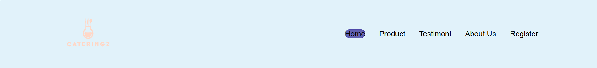

# 🍱 CateriNgz - Catering Website Project (HCI)

This repository contains the **CateriNgz** project, developed as part of the **Human-Computer Interaction (HCI)** course.  
The project implements a responsive catering website using **HTML, CSS, and JavaScript**, supported by design mockups created in **Figma**.

---

## 👨‍💻 Author
- **Name:** Ignatius Abraham Aristio Kusnadi  
- **NIM:** 2702243590  

---

## 🎨 Design Resources

### Fonts
- **Figma:** Nunito, League Gothic, Khand, Alfa Slab One, Yeseva One  
- **HTML, CSS, JS:** Nunito  

### Color Palette
- Defined both in **Figma** and implementation using **HTML/CSS**.  

### Assets & References
- Backgrounds and wallpapers related to catering & food  
- Inspirations from **Sarasa.id**, **Charlie's Catering**, **CaterSpot**, Pinterest references, and more.  
- Several **YouTube tutorials** were used for responsive design and footer development.  

---

## 📄 Website Pages & Features

### 1. Header & Footer
- **Header:** Navigation bar to access all pages.  
- **Footer:** Contains quick links (e.g., About Us), and social media icons linked to respective platforms.  
- Fully responsive for desktop, tablet, and mobile.  

📷 **Screenshot:**  
#### Header

#### Footer

---

### 2. Home Page
- Showcases current **promotions** with a slideshow feature (navigable via left/right arrows).  
- Section introducing **CateriNgz** with a **Learn More** button linking to About Us page.  
- Recommended products displayed based on customer favorites.  

📷 **Screenshot:**  

---

### 3. Product Page
- Displays available food items with **price per box** and short description.  
- Separated into:
  - **Traditional Indonesian food** section.  
  - **International food** section for customers preferring global cuisine.  
- Fully responsive for tablets and smartphones.  

📷 **Screenshot:**  

---

### 4. Testimonial Page
- Shows feedback from loyal customers with:  
  - Customer name, occupation, rating (1–5), and detailed review.  
- Designed to build trust and credibility.  

📷 **Screenshot:**  

---

### 5. About Us Page
- Provides history and journey of **CateriNgz**.  
- Explains commitment to using quality ingredients for customer satisfaction.  
- Includes an **Order Now** button linking to the Product Page.  
- Showcases company services with hover effects highlighting unique strengths.  

📷 **Screenshot:**  

---

### 6. Registration Page
- Account creation form with **5 validation rules**:
  1. Name must be more than 5 characters.  
  2. Email must end with **@gmail.com**.  
  3. Password must include both letters and numbers.  
  4. Confirm Password must match the password.  
  5. Date of Birth must be before the registration date.  
- User must also agree to **EULA** by ticking the checkbox.  
- Form is fully responsive and validates inputs before submission.  

📷 **Screenshot:**  

---

## 📱 Responsiveness
- All pages are optimized for **desktop, tablet, and mobile devices**.  
- Layouts adjust dynamically with media queries in CSS.  

📷 **Screenshot Example:**  

---

## 🙏 Acknowledgment
- Developed for the **HCI course** as part of a hands-on learning project.  
- References from various catering websites, design inspirations, and coding tutorials.  
